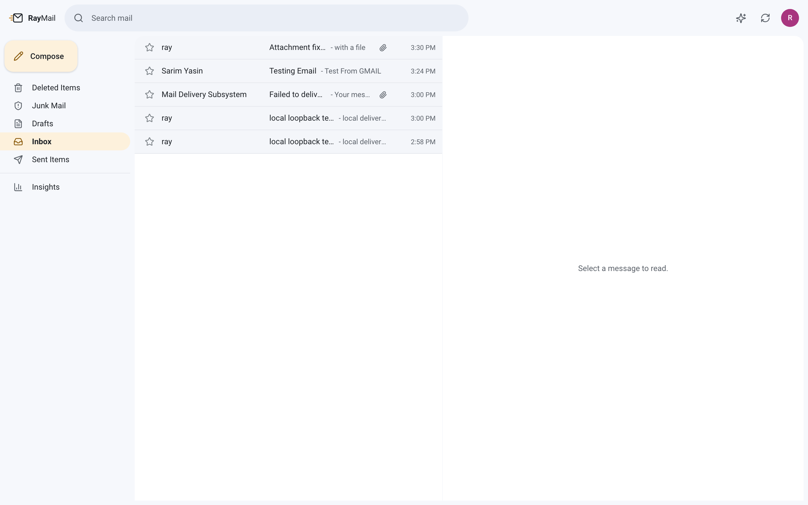
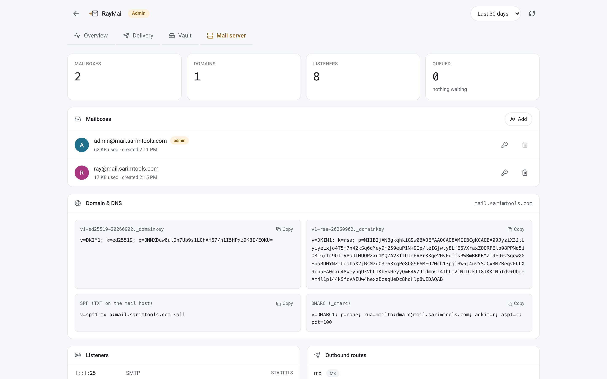
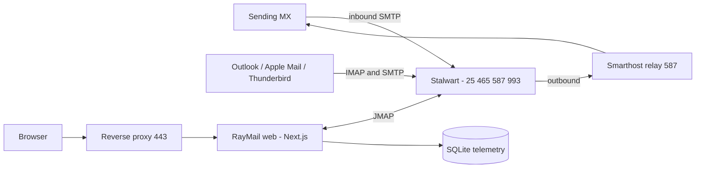
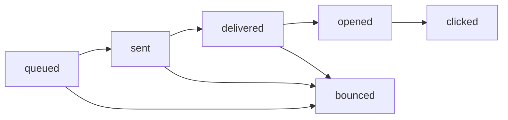

<div align="center">

<picture>
  <source media="(prefers-color-scheme: dark)" srcset=".github/assets/logo-dark.svg">
  <source media="(prefers-color-scheme: light)" srcset=".github/assets/logo-light.svg">
  
</picture>

### Self-hosted mail server, webmail client and delivery telemetry — in one `docker compose up`

<a href="https://github.com/DeveloperSarim/raymail/actions/workflows/ci.yml"></a>
<a href="LICENSE"></a>
<a href="https://github.com/DeveloperSarim/raymail/releases"></a>
<a href="https://stalw.art"></a>
<a href="https://nextjs.org"></a>

<a href="https://github.com/DeveloperSarim/raymail/stargazers"></a>
<a href="https://github.com/DeveloperSarim/raymail/network/members"></a>
<a href="https://github.com/DeveloperSarim/raymail/issues"></a>


<br>


<br><br>

**[Quick start](#-quick-start)** · **[Features](#-features)** · **[Architecture](#-architecture)** · **[Configuration](#%EF%B8%8F-configuration)** · **[Deliverability](#-deliverability)** · **[Contributing](#-contributing)**

</div>

---

## What is RayMail?

**RayMail** is a complete, **open-source, self-hosted email stack** you run on your own VPS. It replaces the usual pile of Postfix + Dovecot + Roundcube + a tracking SaaS with one Docker Compose file:

- **A real mail server** — RFC-compliant SMTP, IMAP and JMAP from [Stalwart](https://stalw.art), with automatic DKIM key generation.
- **A modern webmail client** — a fast, Gmail-style three-pane workspace built in Next.js 15 and TypeScript.
- **Delivery telemetry that is actually yours** — open and click tracking, a full `queued → sent → delivered → opened → clicked` pipeline, and a document vault, all stored locally in SQLite. No third-party tracking pixel, no data leaving your server.
- **An optional AI assistant** — draft replies, summarise long threads and brief your inbox, with aggressive token budgeting so it stays cheap.

Desktop and mobile clients (**Outlook, Apple Mail, Thunderbird, K-9, Gmail app**) connect over standard IMAP/SMTP. The webmail speaks JMAP over the internal Docker network, so mail credentials never reach the browser.

<div align="center">



</div>

---

## ⚡ Quick start

### One command

```bash
curl -fsSL https://raw.githubusercontent.com/DeveloperSarim/raymail/main/install.sh | bash
```

The installer audits your ports, warns you if your provider blocks outbound `:25`, generates secrets, fixes container volume ownership, starts the stack, completes the mail-server setup handshake and prints the exact DNS records you need.

### Manual

<details>
<summary><b>Step by step (click to expand)</b></summary>

```bash
# 1. clone
git clone https://github.com/DeveloperSarim/raymail.git
cd raymail

# 2. configure
cp .env.example .env
$EDITOR .env          # set MAIL_DOMAIN, MAIL_HOSTNAME, APP_URL

# 3. prepare volumes
#    both containers run unprivileged - root-owned bind mounts are the
#    single most common first-boot failure
mkdir -p stalwart/etc stalwart/data/logs data
sudo chown -R 2000:2000 stalwart/etc stalwart/data   # stalwart runs as uid 2000
sudo chown -R 1001:1001 data                         # web runs as uid 1001

# 4. start
docker compose up -d

# 5. finish setup, then print your DNS records
./deploy/dns-records.py

# 6. TLS + reverse proxy
sudo ./deploy/setup-tls.sh

# 7. health check
./deploy/verify.sh
```

</details>

### Requirements

| | Minimum |
|---|---|
| OS | Any Linux with Docker (Ubuntu 22.04+ tested), or macOS for local development |
| RAM | 1 GB (2 GB comfortable) |
| Disk | 5 GB + your mail |
| Ports | `25`, `465`, `587`, `993` free, plus two loopback ports |
| DNS | A domain you control |

---

## ✨ Features

<table>
<tr>
<td width="50%" valign="top">

### 📬 Mail engine
- Inbound SMTP on `:25`
- Submission on `:587` (STARTTLS) and `:465` (implicit TLS)
- IMAP over TLS on `:993`
- JMAP + WebSocket for the webmail
- ManageSieve on `:4190`
- Automatic **DKIM** (RSA + Ed25519)
- SPF and DMARC record generation
- Smarthost relay for hosts that block `:25`

</td>
<td width="50%" valign="top">

### 📊 Telemetry
- 1×1 zero-cache open pixel
- Signed click redirector — **no open-redirect**
- Full delivery pipeline, reconciled against the MTA
- Open/click rates, bounce tracking
- Per-message audit trail with IP and user agent
- Document vault indexing every attachment
- All of it in local SQLite

</td>
</tr>
<tr>
<td width="50%" valign="top">

### 💌 Webmail
- Gmail-style three-pane workspace
- Search, star, archive, delete
- **Sandboxed** message reader — no CSS bleed, no XSS
- Remote images blocked until you ask
- Attachment previews (images, PDF, text)
- Composer with drag-and-drop and CSS inlining
- `⌘/Ctrl + Enter` to send
- Responsive down to a phone

</td>
<td width="50%" valign="top">

### 🤖 AI assistant *(optional)*
- Draft a new email from a one-line prompt
- Draft a reply from the thread
- Per-message summary with extracted actions
- Whole-inbox overview
- Four tones: professional, friendly, direct, apologetic
- **Token-budgeted** — see the table below
- Disabled cleanly when no API key is set

</td>
</tr>
</table>

<div align="center">

<sub><i>The built-in mail server console — create mailboxes, rotate passwords, copy DNS records, inspect listeners and the outbound queue.</i></sub>
</div>

---

## 🏗 Architecture



**Delivery pipeline** — a message only moves forward; `bounced` is terminal from anywhere.



### Port map

| Port | Bind | Purpose | Exposed |
|------|------|---------|---------|
| `25` | `0.0.0.0` | Inbound MX | 🌍 Public |
| `465` | `0.0.0.0` | SMTP submission, implicit TLS | 🌍 Public |
| `587` | `0.0.0.0` | SMTP submission, STARTTLS | 🌍 Public |
| `993` | `0.0.0.0` | IMAP, implicit TLS | 🌍 Public |
| `3880` | `127.0.0.1` | Webmail + telemetry API | 🔒 Proxy only |
| `3881` | `127.0.0.1` | Mail server admin + JMAP | 🔒 Loopback only |

> RayMail never binds `:80` or `:443` — those stay with whatever web server you already run.

### Project layout

```
raymail/
├── docker-compose.yml        # stalwart + web
├── install.sh                # one-command installer
├── deploy/
│   ├── setup-tls.sh          # certbot + reverse-proxy vhost
│   ├── configure-relay.py    # smarthost for blocked :25
│   ├── dns-records.py        # prints records incl. live DKIM
│   └── verify.sh             # read-only health check
└── web/src/
    ├── app/                  # routes: pages at /, API under /api
    ├── components/           # presentational UI
    ├── hooks/                # TanStack Query bindings
    ├── lib/                  # db, telemetry tokens, session crypto
    ├── services/             # JMAP + Stalwart admin + DeepSeek clients
    └── types/                # domain models
```

---

## ⚙️ Configuration

Everything lives in `.env`.

| Variable | Required | Purpose |
|---|:---:|---|
| `MAIL_DOMAIN` | ✅ | Domain RayMail handles mail for |
| `MAIL_HOSTNAME` | ✅ | Public hostname, used in SMTP greetings |
| `APP_URL` | ✅ | Public URL, used for tracking links |
| `TELEMETRY_SECRET` | ✅ | Signs tracking tokens and encrypts sessions |
| `STALWART_ADMIN_USER` / `_PASSWORD` | ✅ | Administrator mailbox |
| `RELAY_HOST` / `_PORT` / `_USERNAME` / `_PASSWORD` | ⚠️ | Smarthost — required when `:25` is blocked |
| `DEEPSEEK_API_KEY` | ➖ | Enables the AI assistant |
| `DEEPSEEK_MODEL` | ➖ | Defaults to `deepseek-chat` |

<details>
<summary><b>Desktop client settings</b></summary>

```
Incoming   IMAP    mail.example.com   993   SSL/TLS
Outgoing   SMTP    mail.example.com   587   STARTTLS
Username   the full address, you@mail.example.com
Password   your mailbox password
Auth       normal password, required for outgoing
```

Works with Microsoft Outlook, Apple Mail, Thunderbird, K-9 Mail and the Gmail app.

</details>

<details>
<summary><b>AI token budgeting</b></summary>

The cost control is in what is **not** sent to the model:

| Lever | Effect |
|---|---|
| HTML stripped to text | Drops markup, styles and tracking pixels before the model sees anything |
| Quoted history removed | A reply chain repeats the thread on every message; it is paid for once |
| Character budget | Bodies capped at ~6k characters, biased to the head where the ask lives |
| Overview uses envelopes only | Sender + subject + preview — hundreds of tokens instead of tens of thousands |
| Results cached on a content hash | Re-opening a message costs nothing; only changed mail is re-summarised |
| `max_tokens` per task | Every task has a natural length and is capped to it |

Actual spend is shown in the admin dashboard, split into tokens in, tokens out, and results served from cache.

</details>

---

## 📮 Deliverability

Self-hosted mail lands in spam for a small number of fixable reasons. In order of impact:

1. **PTR mismatch** — forward and reverse DNS must agree. Set the reverse record for your IP to your mail hostname.
2. **Missing or misaligned DKIM/SPF/DMARC** — `./deploy/dns-records.py` prints the exact records, including your live DKIM public keys.
3. **Blocked outbound `:25`** — many providers block it. RayMail then relays through a smarthost on `:587`; inbound `:25` is unaffected.
4. **DMARC alignment** — if you relay, your Return-Path is usually a subdomain. Use **relaxed** alignment (`adkim=r; aspf=r`) or every relayed message fails.
5. **A brand-new domain has no reputation.** Start with `p=none`, send slowly, and tighten to `p=quarantine` once reports come back clean.

<details>
<summary><b>Troubleshooting matrix</b></summary>

| Symptom | Likely cause | Check |
|---|---|---|
| Outbound mail stuck in queue | `:25` egress blocked, no relay set | `RELAY_HOST` in `.env` |
| Container exits on first boot | Root-owned bind mounts | `chown -R 2000:2000 stalwart/` |
| `certbot` fails | `A` record missing or not propagated | `dig +short A mail.example.com` |
| Outlook rejects the password | Using the local part, not the full address | Log in as `you@mail.example.com` |
| `465`/`993` silent, no handshake | No certificate installed yet | Run `./deploy/setup-tls.sh` |
| TLS warning in a mail client | Server started before the cert existed | `docker restart raymail-stalwart` |
| Opens never register | Recipient blocks remote images | Expected — clicks still track |
| Mail goes to spam | See the five points above | Gmail → **Show original** |
| Reverse proxy won't reload | Vhost syntax | `apache2ctl configtest` |

</details>

---

## 🧪 Development

```bash
cd web
npm install
npm run dev        # http://localhost:3000
npm run typecheck  # tsc --noEmit, strict mode
npm test           # token forgery + open-redirect guards
```

The test suite runs on Node's built-in runner with no framework. It covers the security boundary that matters most: tracking tokens are HMAC-signed, so opens and clicks cannot be forged and the click redirector cannot be repointed at another host.

---

## 🤝 Contributing

Contributions are welcome — issues, features and documentation alike.

1. Fork the repository and create a branch: `git checkout -b feature/my-change`
2. Keep TypeScript strict — `npm run typecheck` must pass
3. Add a test when you touch security or money paths
4. Commit with a clear message and open a pull request

<details>
<summary><b>Good first issues</b></summary>

- Server-side JMAP search (the list currently filters client-side)
- Bounce ingestion from the Stalwart queue into the telemetry pipeline
- Multi-account support in the webmail
- A nginx and a Caddy variant of `deploy/setup-tls.sh`
- Thread grouping in the message list

</details>

<div align="center">
<br>
<a href="https://github.com/DeveloperSarim/raymail/graphs/contributors"></a>
<a href="https://github.com/DeveloperSarim/raymail/pulls"></a>
<a href="https://github.com/DeveloperSarim/raymail/commits/main"></a>
</div>

---

## 📄 License

Released under the [MIT License](LICENSE). Use it, fork it, ship it.

## 🙏 Built on

[Stalwart Mail Server](https://stalw.art) · [Next.js](https://nextjs.org) · [Tailwind CSS](https://tailwindcss.com) · [TanStack Query](https://tanstack.com/query) · [Zustand](https://zustand-demo.pmnd.rs) · [Lucide](https://lucide.dev)

<div align="center">
<br>
<sub>Built and maintained by <a href="https://github.com/DeveloperSarim"><b>DeveloperSarim</b></a></sub>
<br><br>
<sub><b>Keywords</b> — self-hosted email server · open source webmail · docker mail server · email tracking · open and click tracking · SMTP IMAP JMAP server · DKIM SPF DMARC · Stalwart mail · Next.js webmail client · privacy-first email · self-hosted Gmail alternative</sub>
</div>
